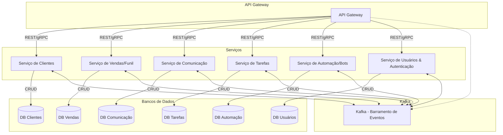

# Diagrama de Arquitetura Distribuída (CRM)

---

Este diagrama mostra a comunicação entre os microserviços, seus bancos de dados isolados, o barramento de eventos Kafka e o gateway de entrada.

Sugestão: Visualize este diagrama usando o plugin Mermaid no VS Code ou ferramentas online para melhor entendimento visual.
